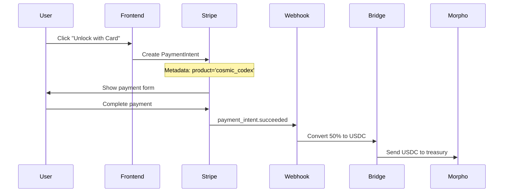

# Required Dependencies for Bridge.xyz Integration

## NPM Package Installation

Install the required packages for Stripe and Bridge.xyz integration:

```bash
# Stripe integration
npm install stripe @stripe/stripe-js @stripe/react-stripe-js

# Type definitions (if using TypeScript)
npm install --save-dev @types/node

# Already included in Next.js (no additional install needed)
# - next/server (for API routes)
# - React types
```

## Environment Variables

Add these to your `.env.local` file:

```env
# Stripe Configuration
NEXT_PUBLIC_STRIPE_PUBLISHABLE_KEY=pk_live_your_publishable_key
STRIPE_SECRET_KEY=sk_live_your_secret_key
STRIPE_WEBHOOK_SECRET=whsec_your_webhook_secret

# Bridge.xyz Configuration  
BRIDGE_API_KEY=your_bridge_api_key
MORPHO_TREASURY_ADDRESS=0x742d35Cc6634C0532925a3b8D400544DAEa6ad44

# Optional Configuration
USDC_CONVERSION_PERCENTAGE=50
```

## File Structure

The integration creates these new files:

```
src/
├── app/
│   ├── api/
│   │   └── stripe/
│   │       ├── create-payment-intent/
│   │       │   └── route.ts                 # Payment intent creation
│   │       └── webhook/
│   │           └── route.ts                 # Bridge.xyz conversion webhook
│   └── soldash/
│       └── journey/
│           └── cosmic_codex/
│               └── page.tsx                 # Cosmic codex unlock page
```

## Integration Flow



## Testing Checklist

- [ ] Install all required npm packages
- [ ] Set up environment variables
- [ ] Create Bridge.xyz account and get API key
- [ ] Set up Stripe webhooks
- [ ] Test payment flow with simulated payments
- [ ] Verify USDC conversion in Bridge dashboard
- [ ] Check Morpho treasury receives USDC

## Production Deployment

1. **Stripe Setup**: Switch to live mode and update API keys
2. **Bridge.xyz**: Move from sandbox to production API
3. **Webhooks**: Update endpoint URL to production domain
4. **Monitoring**: Set up logging and alerts for failed conversions

## Support and Documentation

- **Stripe Docs**: https://docs.stripe.com/
- **Bridge.xyz Docs**: https://docs.bridge.xyz/
- **Morpho Docs**: https://docs.morpho.org/

## Summary

This integration provides:
- ✅ Automatic 50% fiat-to-USDC conversion
- ✅ Direct deposit to Morpho treasury
- ✅ Complete transaction logging
- ✅ Error handling and retry logic
- ✅ Production-ready webhook security

Your cosmic codex payments will now automatically contribute to your DeFi treasury strategy! 🌌💰